# 🔍 AI Research Assistant

A premium, multi-source RAG-based research assistant built with Python, PydanticAI, and Qdrant. This assistant empowers users to ingest diverse data sources—including PDFs, web pages, YouTube transcripts, and GitHub repositories—and perform intelligent, context-aware research.

---

## 🏗️ Architecture Overview

The system follows a modular agentic architecture, separating data ingestion, vector storage, and the reasoning engine.

```mermaid
graph TD
    subgraph "Data Ingestion Layer"
        PDF["📄 PDF Files"] --> DL["Document Loader"]
        Web["🌐 Web Pages"] --> DL
        YT["🎥 YouTube Transcripts"] --> DL
        Repo["📂 GitHub Repos"] --> DL
    end

    subgraph "Processing & Storage"
        DL --> IC["Intelligent Chunking<br/>(Llama 3.1)"]
        IC --> VS["Qdrant Vector Store"]
    end

    subgraph "Reasoning & Interaction"
        User["👤 User"] <--> UI["Streamlit Dashboard"]
        UI <--> RA["Research Agent<br/>(PydanticAI)"]
        RA <--> Tools["Research Tools"]
        Tools <--> VS
        Tools <--> Search["Tavily Web Search"]
    end

    subgraph "Persistence & Monitoring"
        RA --> Notes["Research Notes (MD)"]
        RA --> Logs["Interaction Logs (SQLite)"]
    end
```



---

## ✨ Key Features

- **🌐 Multi-Source Ingestion:** Seamlessly process complex document types.
- **🧠 Intelligent Chunking:** Semantic text splitting using LLMs (Llama 3.1) to preserve context better than fixed-size windows.
- **📝 Research Notes:** Save findings directly from your research sessions into structured Markdown files.
- **📊 Operational Monitoring:** Track token usage, API costs, and response latency in real-time.
- **🔗 Smart Citations:** Automatic source attribution with clickable links and page-specific tracking.
- **🐳 Containerized:** Fully dockerized for consistent deployment across environments.

---

## 🚀 Quick Start

### Option 1: Docker (Recommended)

The easiest way to get the system running with all its dependencies (including Qdrant).

1. **Configure Environment:**
   ```bash
   cp .env.example .env
   # Add your GROQ_API_KEY and TAVILY_API_KEY
   ```
2. **Launch:**
   ```bash
   docker-compose up -d --build
   ```
3. **Explore:** Open [http://localhost:8501](http://localhost:8501)

### Option 2: Local Installation (via `uv`)

Recommended for development and rapid testing.

1. **Install `uv`:** [Installation Docs](https://github.com/astral-sh/uv)
2. **Setup Environment:**
   ```bash
   uv venv
   source .venv/bin/activate  # or .venv\Scripts\activate on Windows
   uv sync
   ```
3. **Set Keys:** Create a `.env` file with your API keys.
4. **Run App:**
   ```bash
   uv run streamlit run src/app.py
   ```

---

## 📁 Project Structure

- [src/agents/](file:///d:/Learning/personal-research-assistant-with-multi-source-rag/ai-research-assistant/src/agents/) - Reasoning engine and agent definitions.
- [src/tools/](file:///d:/Learning/personal-research-assistant-with-multi-source-rag/ai-research-assistant/src/tools/) - Modular tools for data retrieval and actions.
- [src/utils/](file:///d:/Learning/personal-research-assistant-with-multi-source-rag/ai-research-assistant/src/utils/) - Core utilities for chunking, storage, and logging.
- [docs/](file:///d:/Learning/personal-research-assistant-with-multi-source-rag/ai-research-assistant/docs/) - Comprehensive system guides and specifications.
- `research_notes/` - Your saved research documents.

---

## 📚 Documentation

For more detailed information, please refer to:

- [User Guide](file:///d:/Learning/personal-research-assistant-with-multi-source-rag/ai-research-assistant/docs/USER_GUIDE.md) - How to use the assistant.
- [API Reference](file:///d:/Learning/personal-research-assistant-with-multi-source-rag/ai-research-assistant/docs/API_REFERENCE.md) - Code-level documentation.
- [Core Modules Spec](file:///d:/Learning/personal-research-assistant-with-multi-source-rag/ai-research-assistant/docs/CORE_MODULES_SPEC.md) - Technical architecture details.

---

## 🧪 Verification

Ensure your environment is correctly configured by running the verification suite:

```bash
uv run python tests/verification/end_to_end_verification.py
```
